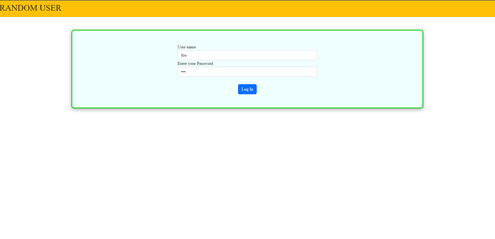
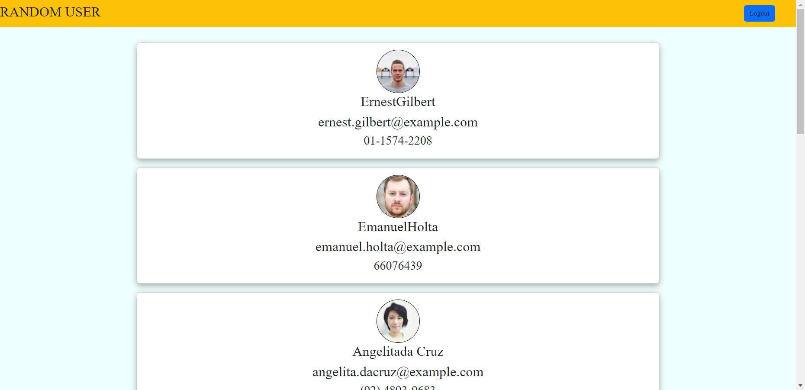
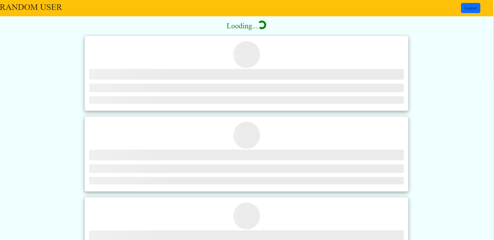
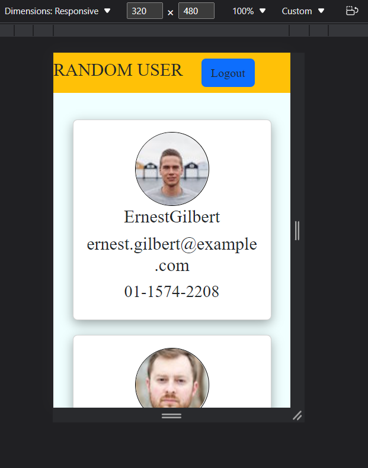

# Responsive infinite scrolling list in react for fixed array of items.

## Components made:

## CardSkeliton-->for showing skeliton animation until user info is loaded

## Form-->for the form (username,password)

## Navbar-->contains logoname and after login gives logout button

## userlist-->list of user information

## Api used:

https://randomuser.me/api/?results=9

##

username:foo
password:bar

## Login page:

## Home page:

## Showing skeleton while loading:

## responsive page:

